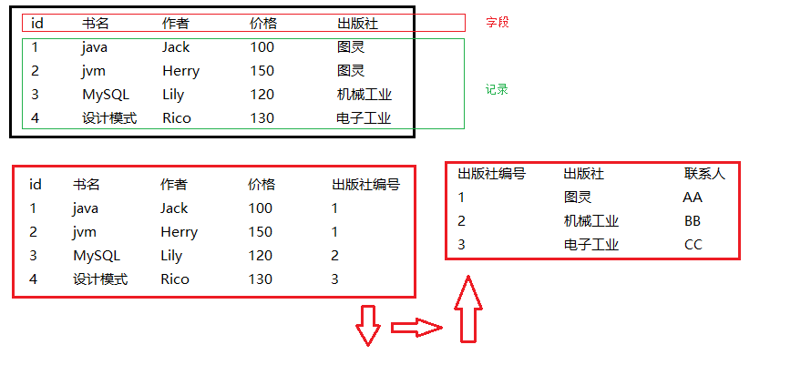
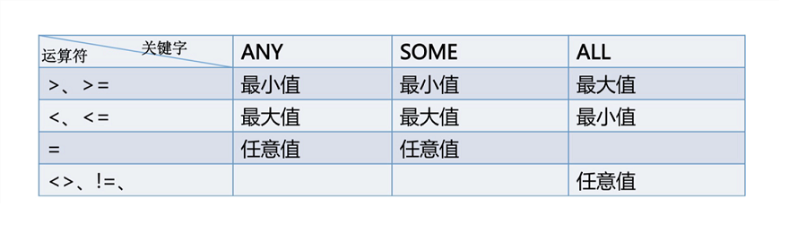

# MySQL数据库

- MySQL 是最流行的关系型数据库管理系统，在 WEB 应用方面 MySQL 是最好的 RDBMS(Relational Database Management System：关系数据库管理系统)应用软件之一。

- MySQL 是一个关系型数据库管理系统，由瑞典 MySQL AB 公司开发，目前属于 Oracle 公司。MySQL 是一种关联数据库管理系统，关联数据库将数据保存在不同的表中，而不是将所有数据放在一个大仓库内，这样就增加了速度并提高了灵活性。
- MySQL 是开源的，所以你不需要支付额外的费用。
- MySQL 支持大型的数据库。可以处理拥有上千万条记录的大型数据库。
- MySQL 使用标准的 SQL 数据语言形式。
- MySQL 可以运行于多个系统上，并且支持多种语言。这些编程语言包括 C、C++、Python、Java、Perl、PHP、Eiffel、Ruby 和 Tcl 等。
- MySQL 支持大型数据库，支持 5000 万条记录的数据仓库，32 位系统表文件最大可支持 4GB，64 位系统支持最大的表文件为8TB。
- MySQL 是可以定制的，采用了 GPL 协议，你可以修改源码来开发自己的 MySQL 系统。

## 数据库相关概念

- DB：数据库，保存一组有组织的数据的容器
- DBMS：数据库管理系统，又称为数据库软件（产品），用于管理DB中的数据
- SQL:结构化查询语言，用于和DBMS通信的语言

## 关系型数据库

- 数据库（Database）是按照数据结构来组织、存储和管理数据的仓库。

- 每个数据库都有一个或多个不同的 API 用于创建，访问，管理，搜索和复制所保存的数据。

- 我们也可以将数据存储在文件中，但是在文件中读写数据速度相对较慢。

- 所以，现在我们使用关系型数据库管理系统（RDBMS）来存储和管理的大数据量。所谓的关系型数据库，是建立在关系模型基础上的数据库，借助于集合代数等数学概念和方法来处理数据库中的数据。

- RDBMS 即关系数据库管理系统(Relational Database Management System)的特点：
  - 数据以表格的形式出现
  - 每行为各种记录名称
  - 每列为记录名称所对应的数据域
  - 许多的行和列组成一张表单
  - 若干的表单组成database

### RDBMS 术语

- **数据库:** 数据库是一些关联表的集合。
- **数据表:** 表是数据的矩阵。在一个数据库中的表看起来像一个简单的电子表格。
- **列（字段）:** 一列(数据元素) 包含了相同类型的数据, 例如邮政编码的数据。
- **行（记录）：**一行（=元组，或记录）是一组相关的数据，例如一条用户订阅的数据。
- **冗余**：存储两倍数据，冗余降低了性能，但提高了数据的安全性。
- **主键**：主键是唯一的。一个数据表中只能包含一个主键。你可以使用主键来查询数据。
- **外键：**外键用于关联两个表。
- **复合键**：复合键（组合键）将多个列作为一个索引键，一般用于复合索引。
- **索引：**使用索引可快速访问数据库表中的特定信息。索引是对数据库表中一列或多列的值进行排序的一种结构。类似于书籍的目录。
- **参照完整性:** 参照的完整性要求关系中不允许引用不存在的实体。与实体完整性是关系模型必须满足的完整性约束条件，目的是保证数据的一致性。
- 

## MySQL命令

### 启动或停止MySQL服务

```sql
方式一：计算机——右击管理——服务
方式二：通过管理员身份运行
net start 服务名（启动服务）
net stop 服务名（停止服务）
```

### MySQL服务的登录和退出   

```
mysql [-h主机名 -P端口号] -u用户名 -p密码
```

| 参数       | 描述                                        |
| :--------- | :------------------------------------------ |
| *host*     | 可选。规定主机名或 IP 地址。                |
| *username* | 可选。规定 MySQL 用户名。                   |
| *password* | 可选。规定 MySQL 密码。                     |
| *port*     | 可选。规定尝试连接到 MySQL 服务器的端口号。 |

### MySQL操作数据库命令

```sql
1.创建数据库
CREATE DATABASE 数据库名;
2.删除数据库
drop database 数据库名;
3.选择数据库
use 数据库名;
4.显示MySQL管理的所有数据库
SHOW DATABASES;
5.查看当前打开的数据库
SELECT DATABASE();
```

###  数据库数据类型

#### 数值类型

| 类型         | 大小                                     | 范围（有符号）                                               | 范围（无符号）                                               | 用途            |
| :----------- | :--------------------------------------- | :----------------------------------------------------------- | :----------------------------------------------------------- | :-------------- |
| TINYINT      | 1 字节                                   | (-128，127)                                                  | (0，255)                                                     | 小整数值        |
| SMALLINT     | 2 字节                                   | (-32 768，32 767)                                            | (0，65 535)                                                  | 大整数值        |
| MEDIUMINT    | 3 字节                                   | (-8 388 608，8 388 607)                                      | (0，16 777 215)                                              | 大整数值        |
| INT或INTEGER | 4 字节                                   | (-2 147 483 648，2 147 483 647)                              | (0，4 294 967 295)                                           | 大整数值        |
| BIGINT       | 8 字节                                   | (-9,223,372,036,854,775,808，9 223 372 036 854 775 807)      | (0，18 446 744 073 709 551 615)                              | 极大整数值      |
| FLOAT(8,2)   | 4 字节                                   | (-3.402 823 466 E+38，-1.175 494 351 E-38)，0，(1.175 494 351 E-38，3.402 823 466 351 E+38) | 0，(1.175 494 351 E-38，3.402 823 466 E+38)                  | 单精度 浮点数值 |
| DOUBLE(5,1)  | 8 字节                                   | (-1.797 693 134 862 315 7 E+308，-2.225 073 858 507 201 4 E-308)，0，(2.225 073 858 507 201 4 E-308，1.797 693 134 862 315 7 E+308) | 0，(2.225 073 858 507 201 4 E-308，1.797 693 134 862 315 7 E+308) | 双精度 浮点数值 |
| DECIMAL      | 对DECIMAL(M,D) ，如果M>D，为M+2否则为D+2 | 依赖于M和D的值                                               | 依赖于M和D的值                                               | 小数值          |

#### 时间类型

| 类型      | 大小 (字节) | 范围                                                         | 格式                | 用途                     |
| :-------- | :---------- | :----------------------------------------------------------- | :------------------ | :----------------------- |
| DATE      | 3           | 1000-01-01/9999-12-31                                        | YYYY-MM-DD          | 日期值                   |
| TIME      | 3           | '-838:59:59'/'838:59:59'                                     | HH:MM:SS            | 时间值或持续时间         |
| YEAR      | 1           | 1901/2155                                                    | YYYY                | 年份值                   |
| DATETIME  | 8           | 1000-01-01 00:00:00/9999-12-31 23:59:59                      | YYYY-MM-DD HH:MM:SS | 混合日期和时间值         |
| TIMESTAMP | 4           | 1970-01-01 00:00:00/2038结束时间是第 **2147483647** 秒，北京时间 **2038-1-19 11:14:07**，格林尼治时间 2038年1月19日 凌晨 03:14:07 | YYYYMMDD HHMMSS     | 混合日期和时间值，时间戳 |

#### 字符串类型

| 类型         | 大小                | 用途                            |
| :----------- | :------------------ | :------------------------------ |
| CHAR(255)    | 0-255字节           | 定长字符串                      |
| VARCHAR(255) | 0-65535 字节        | 变长字符串                      |
| TINYBLOB     | 0-255字节           | 不超过 255 个字符的二进制字符串 |
| TINYTEXT     | 0-255字节           | 短文本字符串                    |
| BLOB         | 0-65 535字节        | 二进制形式的长文本数据          |
| TEXT         | 0-65 535字节        | 长文本数据                      |
| MEDIUMBLOB   | 0-16 777 215字节    | 二进制形式的中等长度文本数据    |
| MEDIUMTEXT   | 0-16 777 215字节    | 中等长度文本数据                |
| LONGBLOB     | 0-4 294 967 295字节 | 二进制形式的极大文本数据        |
| LONGTEXT     | 0-4 294 967 295字节 | 极大文本数据                    |

### 数据表操作命令

```sql
1.创建数据库
CREATE TABLE table_name (column_name column_type);
例子：
CREATE TABLE department (
id INT UNSIGNED PRIMARY KEY AUTO_INCREMENT,
`name` VARCHAR(20) NOT NULL,
manager VARCHAR(25)
);
CREATE TABLE employee(
id INT UNSIGNED PRIMARY KEY AUTO_INCREMENT,
`name` VARCHAR(25) NOT NULL,
sex ENUM('男','女') DEFAULT '男',
salary DOUBLE(8,1),
d_id INT UNSIGNED,
FOREIGN KEY(d_id) REFERENCES department(id)
)
2.删除表
DROP TABLE table_name ;
3.查看表结构
DESC table_name;
```

#### 字段约束

1. 主键约束(PRIMARY KEY）

   1. 每张表只能存在一个主键
   2. 主键的作用主要用于保证记录的唯一性
   3. 主键约束默认添加非空约束（NOT NULL）
   4. 主键值必须唯一

2. 自增约束(AUTO_INCREMENT)

   1. 自增约束必须配合主键使用
   2. 默认情况下，起始值为1，每次的增加量为1 

3. 外键约束（FOREIGN KEY）

   1. 值必须为指向的表的主键值。 

   2. 外键约束主要用于实现一对一，一对多，多对多关系

   3. 外键约束的要求

      1. 父表和子表必须使用相同的存储引擎。 
      2. 外键和参考列的数据类型必须相同。
      3. 外键列和参考列必须创建索引。如果外键列不存在索引的话，MySQL将自动创建索引。

   4. ```sql
      CREATE TABLE user ( 
      id SMALLINT AUTO_INCREMENT PRIMARY KEY, 
      name VARCHAR(20) NOT NULL, 
      pid TINYINT, 
      FOREIGN KEY (pid) REFERENCES province(id) 
      );
      ```

4. 唯一约束（UNIQUE）

   1. 唯一约束可以保证记录的唯一性
   2. 唯一约束的字段可以为空值(NULL) 
   3. 每张表可以有多个唯一约束

5. 非空约束（NOT NULL）

   1. 字段默认为可以为NULL，非空约束的字段不能为NULL

6. 默认约束（DEFAULT）

   1. 当插入记录时，如果没有明确为字段赋值，则自动赋予默认值。

7. 无符号约束（UNSIGNED）

   1. 通过UNSIGNED修饰的整型数只能保存正数

#### 修改表结构

```sql
1.添加列
ALTER TABLE blname ADD [COLUMN] colname >columndefinition [FIRST | AFTER colname]
例：
ALTER TABLE user ADD age TINYINT UNSIGNED; 
ALTER TABLE user ADD password VARCHAR(20) AFTER name;
2.删除列
ALTER TABLE tblname DROP [COLUMN] colname
例：
ALTER TABLE user DROP password;
3.添加外键约束
ALTER TABLE tblname ADD FOREIGN KEY (indexcolname) referencedefinition
例：
ALTER TABLE user02 ADD FOREIGN KEY (pid) REFERENCES province(id);
4.添加非空约束
ALTER TABLE user MODIFY id TINYINT UNSIGNED NOT NULL;
5.修改字段数据类型
ALTER TABLE tbl_name MODIFY COLUMN name TEXT
```

### 数据操作命令

#### 插入语句

```sql
INSERT INTO table_name (field1, field2,...fieldN) VALUES (value1, value2,...valueN);
```

#### 查询数据

```sql
SELECT column_name,column_name
FROM table_name
[WHERE Clause]
[LIMIT N][ OFFSET M]
```

- 查询语句中你可以使用一个或者多个表，表之间使用逗号(,)分割，并使用WHERE语句来设定查询条件。
- SELECT 命令可以读取一条或者多条记录。
- 你可以使用星号（*）来代替其他字段，SELECT语句会返回表的所有字段数据
- 你可以使用 WHERE 语句来包含任何条件。
- 你可以使用 LIMIT 属性来设定返回的记录数。
- 你可以通过OFFSET指定SELECT语句开始查询的数据偏移量。默认情况下偏移量为0。

#### WHERE语句

- 你可以在 WHERE 子句中指定任何条件。
- 你可以使用 AND 或者 OR 指定一个或多个条件。
- WHERE 子句也可以运用于 SQL 的 DELETE 或者 UPDATE 命令。
- WHERE 子句类似于程序语言中的 if 条件，根据 MySQL 表中的字段值来读取指定的数据。
- WHERE支持条件运算符：> < >= <= = != <>

#### 更新数据

```sql
UPDATE table_name SET field1=new-value1, field2=new-value2
[WHERE Clause]
```

- 你可以同时更新一个或多个字段。
- 你可以在 WHERE 子句中指定任何条件。
- 你可以在一个单独表中同时更新数据。

#### 删除数据

```sql
DELETE FROM table_name [WHERE Clause]
```

- 如果没有指定 WHERE 子句，MySQL 表中的所有记录将被删除。
- 你可以在 WHERE 子句中指定任何条件
- 您可以在单个表中一次性删除记录。

## 高级查询

### 排序查询（ORDER BY）

- 使用order by 可以对查询出来的结果进行排序
- 默认采用升序的方式
- 可以使用DESC（降序）、ASC（升序）控制排序的方式

```
SELECT * FROM student ORDER BY birth DESC;
```

### 常用函数

```sql
1.字符函数
    concat拼接
    substr截取子串
    upper转换成大写
    lower转换成小写
    trim去前后指定的空格和字符
    ltrim去左边空格
    rtrim去右边空格
    replace替换
    lpad左填充
    rpad右填充
    instr返回子串第一次出现的索引
    length 获取字节个数
2、数学函数
	round 四舍五入
	rand 随机数
	floor向下取整
	ceil向上取整
	mod取余
	truncate截断
3、日期函数
	now当前系统日期+时间
	curdate当前系统日期
	curtime当前系统时间
	/*
    %Y：代表4位的年份 
    %y：代表2为的年份

    %m：代表月, 格式为(01……12) 
        %c：代表月, 格式为(1……12)

    %d：代表月份中的天数,格式为(00……31) 
    %e：代表月份中的天数, 格式为(0……31)

    %H：代表小时,格式为(00……23) 
    %k：代表 小时,格式为(0……23) 
    %h： 代表小时,格式为(01……12) 
    %I： 代表小时,格式为(01……12) 
    %l ：代表小时,格式为(1……12)

    %i： 代表分钟, 格式为(00……59) 【只有这一个代表分钟，大写的I 不代表分钟代表小时】

    %r：代表 时间,格式为12 小时(hh:mm:ss [AP]M) 
    %T：代表 时间,格式为24 小时(hh:mm:ss)

    %S：代表 秒,格式为(00……59) 
    %s：代表 秒,格式为(00……59)
    */
	str_to_date 将字符转换成日期
	date_format将日期转换成字符
4、流程控制函数
	if 处理双分支
	ifnull
	SELECT
	id,stu_id,c_name,
	CASE 
	WHEN IFNULL(grade,0) < 60 THEN
	'E'
	WHEN IFNULL(grade,0) < 70 THEN
	'D'
	WHEN IFNULL(grade,0) < 80 THEN
	'C'
	WHEN IFNULL(grade,0) < 90 THEN
	'B'
	WHEN IFNULL(grade,0) < 100 THEN
	'A'
	ELSE
	'错误'
	END 
		AS grade
    FROM
        score;
5.聚合函数
	sum 求和
	max 最大值
	min 最小值
	avg 平均值
	count 计数
```

### 分组查询（GROUP BY）

- 把查询的结构根据所选字段进行分组，字段值相同则分为一组。打印当前组的第一条数据
- 我们可以先分组再排序
- 不支持先排序再分组
- 如果对查询结果进行了分组，则再添加过滤条件时需要用HAVING

```sql
SELECT stu_id,c_name,grade FROM score GROUP BY stu_id
SELECT stu_id,c_name,grade FROM score GROUP BY stu_id HAVING stu_id > 903;
SELECT stu_id,c_name,grade FROM score WHERE stu_id > 903 GROUP BY stu_id ;
```

### 子查询

- 一个语句查询的结果可以作为另一个查询的条件使用
- 子查询指嵌套在查询内部，且必须始终出现在圆括号内。 
- 子查询可以包含多个关键字或条件，如GROUP BY, ORDER BY, LIMIT，函数等。 
- 子查询的外层查询可以是：SELECT, INSERT, UPDATE, SET 或 DO。

```
#查询成绩大于平均成绩的成绩
SELECT avg(grade) FROM score;
SELECT * FROM score WHERE grade > 85.6;
#子查询
SELECT * FROM score WHERE grade > (SELECT avg(grade) FROM score);
```

- 当子查询的返回不是一个值时：
- 

### 分页查询（limit）

```mysql
SELECT * FROM score WHERE stu_id LIMIT 1,1;
#第一个参数：起始下标
#第二个参数：返回的记录个数

#使用limit实现分页查询
/*
	当前显示的页数 2 index
	每页显示个数  3 number
*/
SELECT * FROM score WHERE stu_id LIMIT (index-1)*number,number;
```

### 多表联查

- 多表联查主要分为三种
  - **INNER JOIN（内连接,或等值连接）**：获取两个表中字段匹配关系的记录。
  - 
  - **LEFT JOIN（左连接）：**获取左表所有记录，即使右表没有对应匹配的记录。
  - 
  - **RIGHT JOIN（右连接）：** 与 LEFT JOIN 相反，用于获取右表所有记录，即使左表没有对应匹配的记录。
  - 

- ```sql
  SELECT * FROM student INNER JOIN teacher ON student.t_id = teacher.id;
  SELECT * FROM student LEFT JOIN teacher ON student.t_id = teacher.id;
  SELECT * FROM student RIGHT JOIN teacher ON student.t_id = teacher.id;
  ```

### 联合查询（union）

```mysql
#联合查询默认取出重复数据
#可以使用 UNION ALL保留重复数据
SELECT id,name FROM student 
UNION
SELECT id,name FROM teacher
...;
```

### 模糊查询（like）

- 使用 %（任意个任意字符） 进行模糊查询
- 时_ (任意一个字符)

```sql
SELECT * FROM student WHERE name LIKE '%曹%';
```

### 正则查询（REGEXP ）

```mysql
SELECT * FROM student WHERE name REGEXP '^.{9}$';
```

### 数据库去重

```mysql
#把查询出的数据保存到新创建的表中
CREATE TABLE test SELECT name,sex FROM teacher;
```

```mysql
# 通过分组去掉重复数据并保存到新表中
CREATE TABLE test SELECT * FROM teacher GROUP BY name,sex;
# 删除旧表
DROP TABLE teacher;
#把新表进行重命名
ALTER TABLE test RENAME TO teacher;
```

### 多表更新

```mysql
UPDATE student INNER JOIN sex ON student.sex = sex.sex SET student.sex = sex.id;
```

## 事务

- 通过一组逻辑操作单元（SQL语句），将数据从一种稳定状态切换到另外一种稳定状态

### 特点

- 一般来说，事务是必须满足4个条件（ACID）：原子性（**A**tomicity，或称不可分割性）、一致性（**C**onsistency）、隔离性（**I**solation，又称独立性）、持久性（**D**urability）。
  - **原子性：**一个事务（transaction）中的所有操作，要么全部完成，要么全部不完成，不会结束在中间某个环节。事务在执行过程中发生错误，会被回滚（Rollback）到事务开始前的状态，就像这个事务从来没有执行过一样。
  - **一致性：**在事务开始之前和事务结束以后，数据库的完整性没有被破坏。这表示写入的资料必须完全符合所有的预设规则，这包含资料的精确度、串联性以及后续数据库可以自发性地完成预定的工作。
  - **隔离性：**数据库允许多个并发事务同时对其数据进行读写和修改的能力，隔离性可以防止多个事务并发执行时由于交叉执行而导致数据的不一致。事务隔离分为不同级别，包括读未提交（Read uncommitted）、读提交（read committed）、可重复读（repeatable read）和串行化（Serializable）。
  - **持久性：**事务处理结束后，对数据的修改就是永久的，即便系统故障也不会丢失。

### 使用事务

#### 隐式事物

```
insert、update、delete语句本身就是一个事务
```

#### 显示事物

```mysql
# 1.开启事务
    BEGIN 
    #或
    SET AUTOCOMMIT=0 #禁止自动提交
    START TRANSACTION
#2.执行SQL语句
	SAVEPOINT identifier # 添加保存点
	ROLLBACK TO identifier #
#3.提交或回滚事务
	ROLLBACK #事务回滚
	COMMIT #事务确认
```

### 隔离级别

#### 事务并发问题如何发生？

- 当多个事务同时操作同一个数据库的相同数据时,数据库数据可能发生损坏。
- 对于同时运行的多个事务, 当这些事务访问数据库中相同的数据时, 如果没有采取必要的隔离机制, 就会导致各种并发问题:
  - 脏读: 对于两个事务 T1, T2, T1 读取了已经被 T2 更新但还没有被提交的字段. 之后, 若 T2 回滚, T1读取的内容就是临时且无效的.
  - 不可重复读: 对于两个事务T1, T2, T1 读取了一个字段, 然后 T2 更新了该字段. 之后, T1再次读取同一个字段, 值就不同了.
  - 幻读: 对于两个事务T1, T2, T1 从一个表中读取了一个字段, 然后 T2 在该表中插入了一些新的行. 之后, 如果 T1 再次读取同一个表, 就会多出几行.
- 数据库事务的隔离性: 数据库系统必须具有隔离并发运行各个事务的能力, 使它们不会相互影响, 避免各种并发问题. 
- 一个事务与其他事务隔离的程度称为隔离级别. 数据库规定了多种事务隔离级别, 不同隔离级别对应不同的干扰程度, 隔离级别越高, 数据一致性就越好, 但并发性越弱.

#### 数据库提供的事务隔离级别


- Oracle 支持的 2 种事务隔离级别：READ COMMITED, SERIALIZABLE。 Oracle 默认的事务隔离级别为: READ COMMITED 
- Mysql 支持 4 种事务隔离级别. Mysql 默认的事务隔离级别为: REPEATABLE READ
- InnoDB和Falcon存储引擎通过多版本并发控制（MVCC，Multiversion Concurrency Control）机制解决了幻读问题。

#### 查看和设置数据库隔离级别

每启动一个 mysql 程序, 就会获得一个单独的数据库连接. 每个数据库连接都有一个全局变量 @@tx_isolation, 表示当前的事务隔离级别
查看当前的隔离级别:

```mysql
#设置当前连接的会话级别
set session transaction isolation level Serializable;
set tx_isolation = 2;
	READ-UNCOMMITTED : 0;
	READ-COMMITTED : 1;
	REPEATABLE-READ : 2;
	SERIALIZABLE : 3;
#设置整个系统会话级别
set @@global.tx_isolation = 3;

#查看当前连接会话级别
SELECT @@tx_isolation;
#查看整个系统会话级别
SELECT @@global.tx_isolation;
```

## 视图

- 视图，虚拟表，从一个表或多个表中导出来的表，作用和真实表一样，包含一系列带有行和列的数据 视图中，用户可以使用SELECT语句查询数据，也可以使用INSERT，UPDATE，DELETE修改记录，视图可以使用户操作方便，并保障数据库系统安全

### 优点

- 简单化，数据所见即所得
- 安全性，用户只能查询或修改他们所能见到得到的数据
- 逻辑独立性，可以屏蔽真实表结构变化带来的影响

### 缺点

- 性能相对较差，简单的查询也会变得稍显复杂
- 修改不方便，特变是复杂的聚合视图基本无法修改

### 视图的作用

1. 简化复杂的sql操作，编写sql查询后重用便捷而无需关注查询细节
2. 对重构数据库提供逻辑独立保护数据，仅部分显示数据
3. 保障机密数据安全
4. 让数据展示更加精简，清晰

### 创建视图

```mysql
CREATE VIEW  视图名
	AS
查询语句;
```

- ### 视图注意事项

  1. 视图名与表名一样必须唯一

  2. 创建视图的必须有足够权限，权限由数据库管理员授予

  3. 视图可以嵌套，即可以从其他视图中检索数据创建新的视图

  4. 不能在视图上建立索引，也不能关联触发器

  5. 视图可以和物理表共同使用

  6. 对视图进行更新时实际更新的是创建视图的表

  7. 有下列内容之一，视图不能做增删改操作：

     ①select子句中包含多表联查

     　②select子句中包含组函数

     　③select语句中包含group by子句

     　④select语句中包含order by子句

     　⑤select语句中包含union 、union all等集合运算符

     　⑥where子句中包含相关子查询

     　⑦from子句中包含多个表

     　⑧如果视图中有计算列，则不能更新

     　⑨如果基表中有某个具有非空约束的列未出现在视图定义中，则不能做insert操作

### 修改视图

```mysql
#方法一
CREATE OR REPLACE VIEW test_v7
	AS
SELECT
	...
#方法二
ALTER VIEW test_v7
	AS
SELECT 
	...
```

### 删除视图

```mysql
DROP VIEW test_v1,test_v2,test_v3;
```

### 查看视图结构

```mysql
#方法一
DESC test_v7;
#方法二
SHOW CREATE VIEW test_v7;
```

## 变量

### 系统变量

#### 全局变量

作用域：针对于所有会话（连接）有效，但不能跨重启

```
查看所有全局变量
SHOW GLOBAL VARIABLES;
查看满足条件的部分系统变量
SHOW GLOBAL VARIABLES LIKE '%char%';
查看指定的系统变量的值
SELECT @@global.autocommit;
为某个系统变量赋值
SET @@global.autocommit=0;
SET GLOBAL autocommit=0;
```

#### 会话变量

作用域：针对于当前会话（连接）有效

```
查看所有会话变量
SHOW SESSION VARIABLES;
查看满足条件的部分会话变量
SHOW SESSION VARIABLES LIKE '%char%';
查看指定的会话变量的值
SELECT @@autocommit;
SELECT @@session.tx_isolation;
为某个会话变量赋值
SET @@session.tx_isolation='read-uncommitted';
SET SESSION tx_isolation='read-committed';
```

### 自定义变量

#### 用户变量

声明并初始化：

```
SET @变量名=值;
SET @变量名:=值;
SELECT @变量名:=值;
```

赋值：

```
方式一：一般用于赋简单的值
SET @变量名=值;
SET @变量名:=值;
SELECT @变量名:=值;

```

```
方式二：一般用于赋表 中的字段值
SELECT 字段名或表达式 INTO 变量
FROM 表;
```

使用：

```
select @变量名;
```

#### 局部变量

**声明：**

```
declare 变量名 类型 【default 值】;
注：此声明只能放到begin end中进行使用，且只能定义在第一行（可以连续定义多个变量）进行使用。
```

**赋值：**

```
方式一：一般用于赋简单的值
SET 变量名=值;
SET 变量名:=值;
SELECT @变量名:=值;
```

```
方式二：一般用于赋表 中的字段值
SELECT 字段名或表达式 INTO 变量FROM 表;
```

**使用：**

```
SELECT 变量名
```

## 存储过程(PROCEDURE)

​	存储过程(Procedure),是数据库操作语言SQL的可编程性实现，传统的SQL语句通常是在数据库服务器中执行一条命令，命令在数据库引擎内部需要经过创建与分析的过程，因此在运行时间上开销较大；而存储过程是预编译的，在首次运行一个存储过程时，查询优化器对其进行分析、优化，并给出最终被存在系统表中的存储计划，这样，后期的使用只需通过命令调用即可，因此，在执行过程时便可节省此开销。

- **存储过程优点**
  - 提高性能
  - 降低网络开销
  - 分担应用程序需要执行的业务逻辑(如:订单生成，通用分页等)
  - 更强的安全性
  - 比sql语句更为强大的处理能力
- **存储过程缺点**
  - 可移植性差(不同数据库服务器存储过程语法差异较大，一旦变更DBMS，则存储过程需要整体重构)
  - 逻辑复杂，不如sql灵活
  - 实际应用相对较少

### 存储过程创建语法

**在命令行中编写存储过程时可通过DELIMITER修改默认结束标记(推荐图形界面工具)** 

DELIMITER \$ (使用“\$”符号作为结束标记，符号可自定义)

### 创建存储过程

```
CREATE PROCEDURE 过程名(in|out|inout 参数名  参数类型,...)
BEGIN
[DECLARE] 临时变量       
-- 执行体
END

参数前面的符号的意思
in:该参数只能作为输入 （该参数不能做返回值）
out：该参数只能作为输出（该参数只能做返回值）
inout：既能做输入又能做输出
```

### 调用存储过程

```
CALL 存储过程名();
```

### 删除存储过程

```
DROP PROCEDURE 存储过程名;
```

## 函数（function）

函数有着跟存储过程类似的实现原理，但是两者之间也存在本质区别，具体如下：

1. 一般来说，存储过程实现的功能要复杂一点，而函数的实现的功能针对性比较强。存储过程，功能强大，可以执行包括修改表等一系列数据库操作；用户定义函数不能用于执行一组修改全局数据库状态的操作。
2. 对于存储过程来说可以返回参数，如记录集，而函数只能返回值或者表对象。函数只能返回一个变量；而存储过程可以返回多个。存储过程的参数可以有IN,OUT,INOUT三种类型，而函数只能有IN类，存储过程声明时不需要返回类型，而函数声明时需要描述返回类型，且函数体中必须包含一个有效的RETURNS语句。
3. 存储过程，可以使用非确定函数，不允许在用户定义函数主体中内置非确定函数。
4. 存储过程一般是作为一个独立的部分来执行（ EXECUTE 语句执行），而函数可以作为查询语句的一个部分来调用（SELECT调用），由于函数可以返回一个表对象，因此它可以在查询语句中位于FROM关键字的后面。 SQL语句中不可用存储过程，而可以使用函数。

**MySQL函数分为以下两类:**

- 预定义函数
- 自定义函数

**其中预定义函数为mysql内置函数主要包含以下:**

- 字符串函数
- 数值函数
- 日期函数
- 系统信息函数
- 加密函数
- 格式化函数

### 创建函数

```
CREATE FUNCTION 函数名(参数名 参数类型,...) RETURNS 返回类型
BEGIN
	函数体
END

int add(int a, int b){
    return a+b;
}
```

### 函数的调用

```
SELECT 函数名（实参列表）
```

### 删除函数

```
DROP FUNCTION 函数名;
```

## 分支

### if函数

​	语法：if(条件，值1，值2)
​	特点：可以用在任何位置

### case语句

语法：

```
情况一：类似于switch
case 表达式
when 值1 then 结果1或语句1(如果是语句，需要加分号) 
when 值2 then 结果2或语句2(如果是语句，需要加分号)
...
else 结果n或语句n(如果是语句，需要加分号)
end 【case】（如果是放在begin end中需要加上case，如果放在select后面不需要）

情况二：类似于多重if
case 
when 条件1 then 结果1或语句1(如果是语句，需要加分号) 
when 条件2 then 结果2或语句2(如果是语句，需要加分号)
...
else 结果n或语句n(如果是语句，需要加分号)
end 【case】（如果是放在begin end中需要加上case，如果放在select后面不需要）
```

**特点：**
​	可以用在任何位置

### if elseif语句

**语法：**

```
if 情况1 then 语句1;
elseif 情况2 then 语句2;
...
else 语句n;
end if;
```

**特点：**
​	只能用在begin end中！！！！！！！！！！！！！！！

**三者比较：**
​			        应用场合
​	if函数		简单双分支
​	case结构	等值判断 的多分支
​	if结构		区间判断 的多分支

## 循环

**语法：**

```
Label:while 循环条件
do
	循环内容
End while label;

Label:repeat
	循环内容
Until 结束条件
repeat label;

Label:loop
	循环内容
loop labeel;
```

**特点：**

```
iterate：跳过当次循环
leave：跳出循环
```

## 触发器

触发器（TRIGGER）是MySQL的数据库对象之一，从5.0.2版本开始支持。该对象与编程语言中的存储过程以及函数非常类似，都是SQL语句可编程性的实现，并且都需要编写、编译以及调用。但是触发器的执行不是由程序调用，也不是由手动启动，而是由事件来触发、激活以及执行。

那么为什么要使用数据库对象触发器呢？在具体开发项目时，经常会遇到如下实例：

**1. 在删除部门表中记录时，员工表因为设置外键约束关联部门表，导致部门表中记录无法删除，如何在执行部门删除时同时将关联的员工表中部门号列设置为NULL。**

**2. 在对员工表中员工数据删除时如何自动将被删除的员工信息记录到备份表中。**

上面的例子使用触发器完成时具有这样的特点，需要在表发生改变时，自动进行一些处理。MySQL在触发DELETE/UPDATE/INSERT语句时就会自动执行所设置的操作，对SELECT语句则不会激活触发器。

### 触发器语法

**触发器创建语法： **

```mysql
CREATE TRIGGER trigger_name
trigger_time trigger_event
ON tbl_name 
FOR EACH ROW
BEGIN	
	trigger_body
END; 
```

**trigger_name：触发器的名称，不能与已经存在的触发器重复；**

**trigger_time：{ BEFORE | AFTER }，表示在事件之前或之后触发；**

**trigger_event:：{ INSERT |UPDATE | DELETE }，触发该触发器的具体事件；**

**tbl_name：该触发器作用在tbl_name上； ** 

**删除触发器: ** 

DROP TRIGGER 触发器名;

```sql
CREATE TRIGGER  #创建触发器
	myt1  #出发器的名字
BEFORE DELETE #什么时候触发
ON
	teacher #触发事件的表
FOR EACH ROW
BEGIN
	UPDATE student SET t_id = null WHERE t_id = OLD.id;
END

DROP TRIGGER myt1;

DELETE FROM teacher WHERE id = 1;

```

> **NEW和OLD**
>
> NEW在触发器为INSERT/UPDATE事件类型时有效，表示当前正在插入的数据；
>
> 同理，OLD在触发器类型为DELETE/UPDATE事件类型时有效，表示当前正在删除的数据。
>
> 具体如下表:
>
> |         | INSERT | UPDATE | DELETE |
> | ------- | ------ | ------ | ------ |
> | **NEW** | 可用   | 可用   | 无效   |
> | **OLD** | 无效   | 可用   | 可用   |